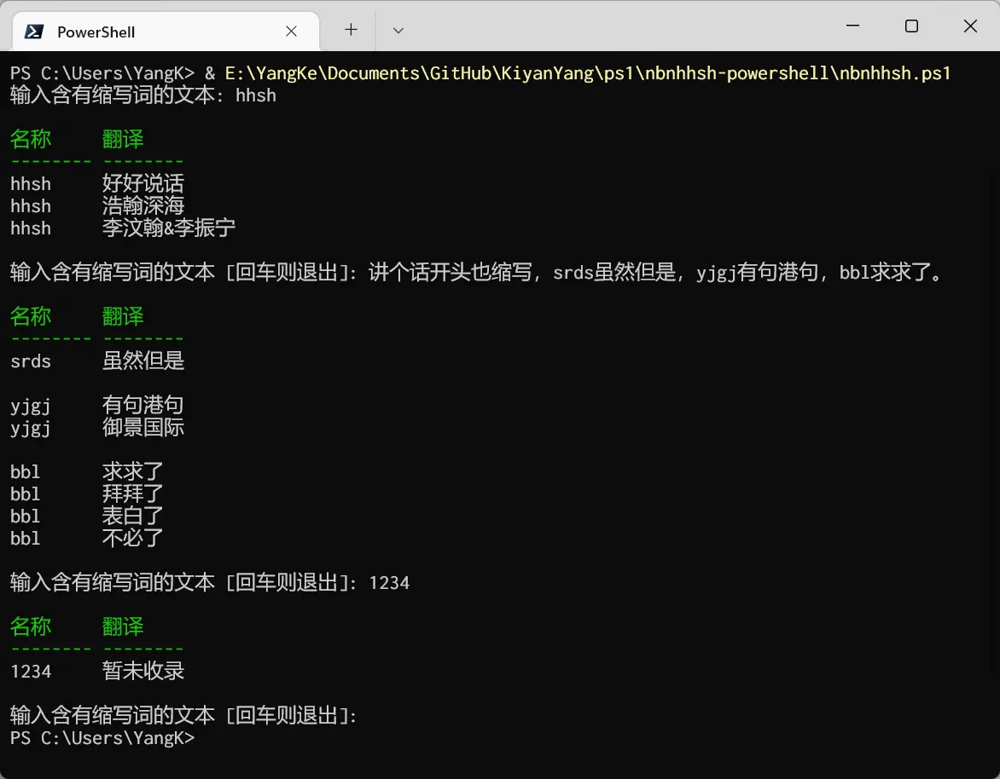

# 「能不能好好说话？」的 powershell 版本

基于 [@itorr](https://github.com/itorr/)「能不能好好说话？」 的 powershell 版本

# 使用

下载根目录下的 [`nbnhhsh.ps1`](https://github.com/KiyanYang/nbnhhsh-powershell/blob/main/nbnhhsh.ps1) 到本地，执行该脚本即可。

# 致谢

- [能不能好好说话？](https://github.com/itorr/nbnhhsh) by [@itorr](https://github.com/itorr/)
